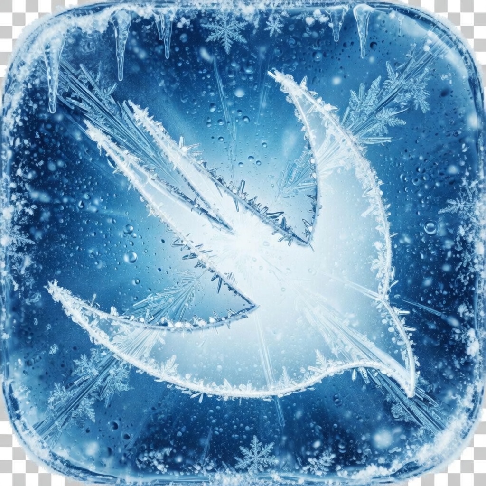

<p align="center">
  
</p>

<p align="center">
<pre>
███████╗██████╗  ██████╗ ███████╗████████╗███████╗ ██████╗██████╗ ██╗██████╗ ███████╗
██╔════╝██╔══██╗██╔═══██╗██╔════╝╚══██╔══╝██╔════╝██╔════╝██╔══██╗██║██╔══██╗██╔════╝
█████╗  ██████╔╝██║   ██║███████╗   ██║   ███████╗██║     ██████╔╝██║██████╔╝█████╗
██╔══╝  ██╔══██╗██║   ██║╚════██║   ██║   ╚════██║██║     ██╔══██╗██║██╔══██╗██╔══╝
██║     ██║  ██║╚██████╔╝███████║   ██║   ███████║╚██████╗██║  ██║██║██████╔╝███████╗
╚═╝     ╚═╝  ╚═╝ ╚═════╝ ╚══════╝   ╚═╝   ╚══════╝ ╚═════╝╚═╝  ╚═╝╚═╝╚═════╝ ╚══════╝
                        ❄  disc to library · natively  ❄
</pre>
</p>

# Frostscribe

A native macOS tool for ripping and preserving physical disc media to a local [Jellyfin](https://jellyfin.org), [Plex](https://plex.tv), or [Kodi](https://kodi.tv) library.

Frostscribe wraps `makemkvcon` and `HandBrakeCLI` into a polished interactive CLI and menu bar app. Insert a disc, confirm the title, and walk away. The background worker handles encoding while you use your Mac normally.

---

## Stability

| Feature | Status |
|---|---|
| Movie ripping — Vigil Mode | ✅ Stable |
| Movie encoding (H.265, hardware) | ✅ Stable |
| Background worker (rip + encode) | ✅ Stable |
| Menu bar app + GUI rip flow | ✅ Stable |
| CLI rip flow | ✅ Stable |
| Event hooks (Home Assistant, etc.) | ✅ Stable |
| TV show ripping | ⚠️ Functional, not thoroughly tested |
| AutoScribe (auto-rip without prompting) | ⚠️ Experimental |

> TV show ripping works end-to-end but has not been tested across a wide variety of discs and edge cases. Episode numbering and season path formatting should be verified for your media server.

---

## Requirements

- macOS 14 or later
- [MakeMKV](https://makemkv.com) — download and install from makemkv.com
- [HandBrake](https://handbrake.fr) CLI:

```bash
brew install handbrake
```

---

## Installation

**Homebrew (recommended):**

```bash
brew tap trevholliday/frostscribe
brew install frostscribe
```

This installs the `frostscribe` CLI, `frostscribe-worker` background daemon, and registers the LaunchAgent so the worker starts automatically on login.

**Menu bar app:**

Download `FrostscribeUI.app` from the [latest release](https://github.com/trevholliday/frostscribe/releases/latest) and move it to `/Applications`.

**Build from source:**

```bash
git clone https://github.com/trevholliday/frostscribe
cd frostscribe
swift build -c release
sudo cp .build/release/frostscribe /usr/local/bin/
sudo cp .build/release/frostscribe-worker /usr/local/bin/
```

---

## Setup

Run the setup wizard on first use:

```bash
frostscribe init
```

This creates `~/Library/Application Support/Frostscribe/config.json` with your output directories, media server selection, and optional API keys.

Then install and start the background worker:

```bash
cp com.frostscribe.worker.plist ~/Library/LaunchAgents/
launchctl load ~/Library/LaunchAgents/com.frostscribe.worker.plist
```

**Why the worker runs as a launchd agent**

Encoding is slow — a Blu-ray can take 30–90 minutes. The worker runs as a persistent background service managed by launchd so it survives terminal sessions, restarts after crashes, and starts automatically on login. It polls the rip and encode queues and processes jobs one at a time using VideoToolbox hardware encoding.

Logs: `~/Library/Logs/Frostscribe/worker.log`

---

## Usage

### Menu bar app (Vigil Mode)

Open **FrostscribeUI** from `/Applications`. The snowflake icon lives in your menu bar and shows rip/encode status at a glance.

Click **Rip Disc** to open the guided rip flow:

1. Disc scans automatically
2. Search TMDB to identify the title (or enter manually)
3. Select the disc title and audio tracks
4. Confirm output path
5. The rip runs in the background worker — closing the app will not interrupt it
6. Encoding begins automatically when the rip finishes
7. Push notification fires on completion (configure via `event_hook`)

**Vigil Mode** (default) means ripping is guided and interactive. Disable it in Settings to enable **AutoScribe**, which rips any inserted disc automatically without prompting.

### CLI

```bash
frostscribe rip          # Guided interactive rip session
frostscribe status       # Current rip and encode status
frostscribe queue        # Encode queue with per-job progress
```

### Manage the worker

```bash
launchctl load ~/Library/LaunchAgents/com.frostscribe.worker.plist    # Start
launchctl unload ~/Library/LaunchAgents/com.frostscribe.worker.plist  # Stop
launchctl kickstart -k gui/$(id -u)/com.frostscribe.worker            # Restart
tail -f ~/Library/Logs/Frostscribe/worker.log                         # Follow logs
```

---

## Output formats

Output paths are automatically formatted for your configured media server.

**Jellyfin / Emby**
```
Movies/The Dark Knight (2008)/The Dark Knight (2008).mkv
TV Shows/Breaking Bad (2008)/Season 01/Breaking Bad (2008) - S01E01.mkv
```

**Plex**
```
Movies/The Dark Knight (2008)/The Dark Knight (2008).mkv
TV Shows/Breaking Bad/Season 01/S01E01.mkv
```

**Kodi**
```
Movies/The Dark Knight (2008)/The Dark Knight (2008).mkv
TV Shows/Breaking Bad/Season01/Breaking Bad S01E01.mkv
```

---

## Configuration

`~/Library/Application Support/Frostscribe/config.json`

| Field | Required | Description |
|---|---|---|
| `media_server` | Yes | `jellyfin`, `plex`, or `kodi` |
| `movies_dir` | Yes | Root directory for movie output |
| `tv_dir` | Yes | Root directory for TV show output |
| `temp_dir` | Yes | Staging area for raw ripped MKV files |
| `tmdb_api_key` | No | TMDB API v3 key for automatic title lookup |
| `makemkv_key` | No | MakeMKV registration key (trial mode without it) |
| `makemkv_bin` | No | Full path to `makemkvcon` (searched in `$PATH` if empty) |
| `handbrake_bin` | No | Full path to `HandBrakeCLI` (searched in `$PATH` if empty) |
| `event_hook` | No | Shell command executed on lifecycle events. Receives `FROSTSCRIBE_EVENT` (`rip_complete`, `encode_complete`, `encode_failed`), `FROSTSCRIBE_TITLE`, and `FROSTSCRIBE_BODY` as environment variables. |
| `vigil_mode` | No | `true` = Vigil Mode (interactive, default). `false` = AutoScribe (auto-rips without prompting) |
| `select_audio_tracks` | No | Prompt to choose audio tracks before ripping (default: `false`) |
| `quality_dvd` | No | HandBrake RF quality for DVD (default: `80`) |
| `quality_bluray` | No | HandBrake RF quality for Blu-ray (default: `70`) |
| `quality_uhd` | No | HandBrake RF quality for UHD Blu-ray (default: `70`) |

### Event hook example (Home Assistant push notification)

```bash
python3 -c "
import urllib.request, json, os
urllib.request.urlopen(
  urllib.request.Request(
    'http://localhost:8123/api/services/notify/mobile_app_YOUR_DEVICE',
    json.dumps({'title': os.environ.get('FROSTSCRIBE_TITLE',''),
                'message': os.environ.get('FROSTSCRIBE_BODY','')}).encode(),
    {'Authorization': 'Bearer YOUR_HA_TOKEN', 'Content-Type': 'application/json'}
  ), timeout=5
)
"
```

---

## Architecture

See [ARCHITECTURE.md](ARCHITECTURE.md) for a full breakdown of the package structure, data flow, and design decisions.

---

## License

[MIT](LICENSE) © 2026 trevholliday
